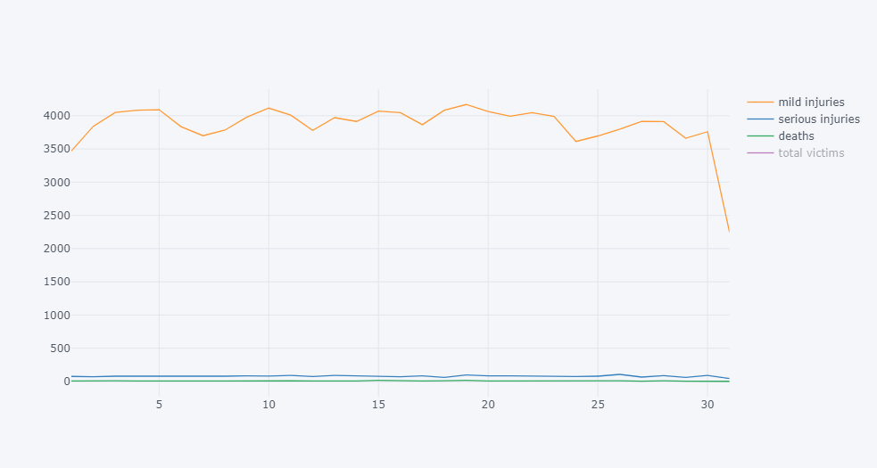
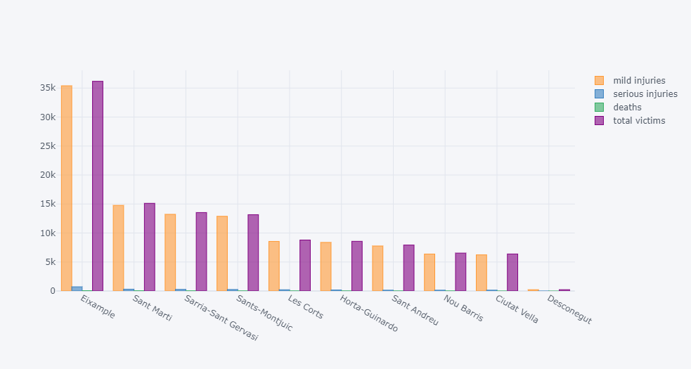

 
# Traffic accidents in Barcelona: data analysis and modelling  
 


*The following article and its related repository are part of the Capstone Project for the Data Science and Big Data Postgraduate Course at Universitat de Barcelona, 2020-2021.*

Autores:

* Marc Iñigo Albalate
* Leonardo Gabriel Papi
* Miguel José Santos Vaz


## Introducción

De acuerdo a la Organización Mundial de la Salud, como consecuencia de accidentes viales cada año mueren alrededor de 1.3 millones de personas en todo el mundo. Mientras que el número de lesionados a nivel mundial varía entre 20 y 50 millones de personas.

**Principales datos:**

* Los accidentes son un riesgo muy superior para niños y jóvenes: Se trata de la primera causa de muerte en personas de entre 5 y 29 años.
* La mitad de los accidentes ocurridos, tienen consecuencias sobre peatones, ciclistas y motociclistas.
* Factores de riesgo: exceso de velocidad, conducción bajo los efectos del alcohol, no utilización de elementos de seguridad (cinturón de seguridad, casco, etc), conducción distraída e infraestructura vial insegura.

En el marco de la Unión Europea, en la actualidad se producen por año alrededor de 49 muertes por millón de habitantes, frente a las 174 por millón en el mundo.
Si bien se trata del continente con menor siniestralidad en carreteras en el mundo, el objetivo para 2030 es reducir a la mitad el número de muertes y lesiones graves. 
<br>En el año 2020, se han visto reducidos los niveles de siniestralidad en todo el continente, y según la Comisión Europea, "el menor volumen de tráfico como consecuencia de la pandemia sanitaria ha tenido un impacto directo, aunque no medible, en esta bajada de la siniestralidad vial". En el caso de España, se encuentra entre los 4 primeros países europeos con menor número de muertes (29 por millón).

Por último, la Ciudad de Barcelona ha tenido durante los últimos 10 años resultados dispares: si bien el número de muertos se ha reducido considerablemente (39 muertos en 2010 - 22 muertos en 2019), el número de accidentes registrados se ha incrementado. Las restricciones de movilidad producto de la pandemia de COVID-19 claramente han tenido un efecto en la siniestralidad, dado que durante 2020 se han reducido un 38% los siniestros en la ciudad.
En la actualidad, la ciudad cuenta con un "Plan local de seguridad vial 2019-2022", con el objetivo de reducir un 20% las víctimas de accidentes.

## Project Overview

El principal objetivo del proyecto es generar predicciones mediante los modelos de aprendizaje automáticos que sea capaz de predecir los accidentes venideros.
Para este proyecto, hemos utilizado información de los accidentes de tránsito ocurridos en la Ciudad de Barcelona, durante los últimos 10 años. Se trata de un dataset muy completo compartido por el Ayuntamiento de Barcelona, a través del sitio web: Open Data BCN (<https://opendata-ajuntament.barcelona.cat>).

Dicha web, cuenta con un total de 5 diferentes dataset relacionados con accidentes de tránsito en la Ciudad. Cada dataset detalla cada uno de los accidentes ocurridos en la Ciudad (identificados con un número de expediente único) pero con información desde diferentes perspectivas. Los datasets son los siguientes:

* *People involved in accidents managed by the Police in the city of Barcelona* 
* *Vehicles involved in accidents handled by the police in the city of Barcelona* 
* *Accidents managed by the local police in the city of Barcelona*
* *Description of the accidents' handled by the police in the city of Barcelona causality* 
* *Accidents managed by the Guàrdia Urbana in the city of Barcelona according to type*

Para "alimentar el modelo", hemos usado el dataset nro 3 - **"Accidents managed by the local police in the city of Barcelona"**, con información desde el año 2010 a 2020. Cabe aclarar que solo el dataframe correspondiente al año 2020 contiene accidentes generados durante la pandemia de COVID-19, con lo cual nos hemos contactado con el Ayuntamiento de la Ciudad para solicitar información sobre accidentalidad durante 2021. Al día de hoy no hemos recibido dicha información.

Por otro lado, en pos de hacer un análisis más abarcativo respecto de la accidentalidad en la ciudad y sus consecuencias, hemos generado una serie de gráficos estadísticos sobre la evolución de los accidentes, víctimas, barrios con mayor cantidad de siniestros, etc. Este análisis se encuentra en el notebook 
**2. Data analysis and exploration**. En este caso, hemos utilizado el dataframe mencionado anteriormente junto con el dataset: **People involved in accidents managed by the Police in the city of Barcelona**.

Este trabajo, se encuentra organizado de la siguiente forma:

* Un fichero con todos los dataframes de 2010 a 2020, correspondientes a los 2 dataset utilizados.
* Un notebook llamado *ETL*, el cual homogeneiza la información y une los dataframes en 2 únicos archivos. Además, incorpora en dichos dataframes la "feature COVID": un valor entre rango 0 y 10. Donde 0 representa una situación previa a la existencia de la enfermedad, y 10 la mayor restricción a la movilidad ocurrida en España durante la pandemia (finales de Marzo 2020 - comienzos de Abril)
* Un notebook llamado *Data analysis and exploration*. Con un análisis contextual sobre la accidentalidad entre 2010 a 2020 en la Ciudad.
* Un notebook con el nombre de *Modelos*. En el mismo, se utiliza una librería de auto Machine-Learning TPOT (<http://epistasislab.github.io/tpot/>) para seleccionar el modelo más adecuado al problema que estamos abordando.
Ante la falta de datos de accidentalidad durante 2021, el modelo fue modificado para generar predicciones a un nivel de agregación por distrito y por mes. En caso que obtengamos dicha información en los siguientes días, modificaremos el modelo acorde a nuestro objetivo inicial: identificar aquellos accidentes en situación de restricción de la movilidad.

<br>

## 1) Data preprocessing 

<br>

 Para este proyecto hemos utilizado 2 datasets relacionados con accidentes viales, que el ayuntamiento de Barcelona publica anualmente en el portal *Open data Barcelona*. 

* **People involved in accidents managed by the Police in the city of Barcelona**: *List of people who have been involved in an accident managed by the Police in the city of Barcelona have suffered some type of injury ( slightly wounded, serious injuries or death). It includes a description of the person ( driver, passenger or pedestrian), sex, age, vehicle associated person if the cause was pedestrian*

* **Accidents managed by the local police in the city of Barcelona**: *List of accidents handled by the local police in the city of Barcelona. Incorporates the number of injuries by severity, the number of vehicles and the point of impact.*

El primero es un registro con todas las personas que formaron parte en cada uno de los accidentes registrados. Por lo que podemos tener 1,2,3 o 4 filas correspondientes al mismo accidente. Todo depende del número de personas involucradas. Cada dataframe cuenta con 31 campos, entre los que se encuentran: fecha, barrio, descripción de la persona, edad, descripción del vehículo involucrado, entre otros. La clave principal es el número de expediente.
El segundo es un resumen del accidente ocurrido y sus consecuencias. Cada dataframe cuenta con 26 campos, siendo los más importantes para nuestro análisis: número de lesionados leves, graves y muertos. La clave principal es el número de expediente.

Cada fichero corresponde a un dataframe por año, iniciando el registro en el año 2010 y finalizando en 2020. Concurrencia para las dos tipologías de fichero, por lo que hemos trabajado con un total de 20 archivos.
Ambos datasets se han utilizado para el análisis exploratorio, pero solo el segundo para la elaboración del modelo. 

A continuación, veremos un resumen del preprocesado de datos realizado (incluyendo parte del codigo):

<br>

1.a) Primero leemos las 10 entradas de datos para luego homogeneizar la información contenida, quitando símbolos y eliminando columnas con información que no se encuentra en todo el conjunto de dataframes.

<br>

```python
import pandas as pd
import numpy as np
import datetime
import unicodedata

#############################################
# First data entries, visualization purposes
#############################################

print("{0} INFO: Starting ETL visualization".format(datetime.datetime.now().strftime('%d/%m/%Y-%H:%M:%S')))

# Read data entries
df_accidents_2010 = pd.read_csv('Dataset/people_involved/2010_ACCIDENTS_PERSONES_GU_BCN_2010.csv', delimiter=',', encoding='latin1', decimal=".")
df_accidents_2011 = pd.read_csv('Dataset/people_involved/2011_ACCIDENTS_PERSONES_GU_BCN_2011.csv', delimiter=',', encoding='latin1', decimal=".")
df_accidents_2012 = pd.read_csv('Dataset/people_involved/2012_ACCIDENTS_PERSONES_GU_BCN_2012.csv', delimiter=',', encoding='latin1', decimal=".")
df_accidents_2013 = pd.read_csv('Dataset/people_involved/2013_ACCIDENTS_PERSONES_GU_BCN_2013.csv', delimiter=',', encoding='latin1', decimal=".")
df_accidents_2014 = pd.read_csv('Dataset/people_involved/2014_ACCIDENTS_PERSONES_GU_BCN_2014.csv', delimiter=',', encoding='latin1', decimal=".")
df_accidents_2015 = pd.read_csv('Dataset/people_involved/2015_ACCIDENTS_PERSONES_GU_BCN_2015.csv', delimiter=',', encoding='latin1', decimal=".")
df_accidents_2016 = pd.read_csv('Dataset/people_involved/2016_accidents_persones_gu_bcn.csv', delimiter=',', encoding='utf8', decimal=".")
df_accidents_2017 = pd.read_csv('Dataset/people_involved/2017_accidents_persones_gu_bcn_.csv', delimiter=',', encoding='utf8', decimal=".")
df_accidents_2018 = pd.read_csv('Dataset/people_involved/2018_accidents_persones_gu_bcn_.csv', delimiter=',', encoding='utf8', decimal=".")
df_accidents_2019 = pd.read_csv('Dataset/people_involved/2019_accidents_persones_gu_bcn_.csv', delimiter=',', encoding='utf8', decimal=".")
df_accidents_2020 = pd.read_csv('Dataset/people_involved/2020_accidents_persones_gu_bcn.csv', delimiter=',', encoding='utf8', decimal=".")

# Prepare column names for homogenization
df_accidents_2010.columns = df_accidents_2010.columns.str.strip().str.lower().str.replace(' ', '_').str.replace('(', '').str.replace(')', '').str.replace('ú', 'u').str.replace("d'", '').str.replace('ó', 'o').str.replace('.', '').str.replace('_de_', '_')
df_accidents_2011.columns = df_accidents_2011.columns.str.strip().str.lower().str.replace(' ', '_').str.replace('(', '').str.replace(')', '').str.replace('ú', 'u').str.replace("d'", '').str.replace('ó', 'o').str.replace('.', '').str.replace('_de_', '_')
df_accidents_2012.columns = df_accidents_2012.columns.str.strip().str.lower().str.replace(' ', '_').str.replace('(', '').str.replace(')', '').str.replace('ú', 'u').str.replace("d'", '').str.replace('ó', 'o').str.replace('.', '').str.replace('_de_', '_')
df_accidents_2013.columns = df_accidents_2013.columns.str.strip().str.lower().str.replace(' ', '_').str.replace('(', '').str.replace(')', '').str.replace('ú', 'u').str.replace("d'", '').str.replace('ó', 'o').str.replace('.', '').str.replace('_de_', '_')
df_accidents_2014.columns = df_accidents_2014.columns.str.strip().str.lower().str.replace(' ', '_').str.replace('(', '').str.replace(')', '').str.replace('£', 'u').str.replace('¢', 'o').str.replace("d'", '').str.replace('.', '').str.replace('_de_', '_')
df_accidents_2015.columns = df_accidents_2015.columns.str.strip().str.lower().str.replace(' ', '_').str.replace('(', '').str.replace(')', '').str.replace('ú', 'u').str.replace("d'", '').str.replace('ó', 'o').str.replace('.', '').str.replace('_de_', '_')
df_accidents_2016.columns = df_accidents_2016.columns.str.strip().str.lower().str.replace(' ', '_').str.replace('(', '').str.replace(')', '')
df_accidents_2017.columns = df_accidents_2017.columns.str.strip().str.lower().str.replace(' ', '_').str.replace('(', '').str.replace(')', '').str.replace('__', '_')
df_accidents_2018.columns = df_accidents_2018.columns.str.strip().str.lower().str.replace(' ', '_').str.replace('(', '').str.replace(')', '').str.replace('__', '_')
df_accidents_2019.columns = df_accidents_2019.columns.str.strip().str.replace(' ', '_').str.replace('(', '').str.replace(')', '').str.replace('ç', 'c').str.replace('ç', 'c').str.replace('ó', 'o').str.lower().str.replace('.1', '').str.replace('__', '_')
df_accidents_2020.columns = df_accidents_2020.columns.str.strip().str.replace(' ', '_').str.replace('(', '').str.replace(')', '').str.replace('ç', 'c').str.replace('ç', 'c').str.replace('ó', 'o').str.lower().str.replace('__', '_')

df_accidents_2010.rename(columns={'nk_any': 'any'}, inplace=True)
df_accidents_2011.rename(columns={'nk_any': 'any'}, inplace=True)
df_accidents_2012.rename(columns={'nk_any': 'any'}, inplace=True)
df_accidents_2013.rename(columns={'nk_any': 'any'}, inplace=True)
df_accidents_2014.rename(columns={'nk_any': 'any'}, inplace=True)
df_accidents_2015.rename(columns={'nk_any': 'any'}, inplace=True)
df_accidents_2019.rename(columns={'nk_any': 'any'}, inplace=True)
df_accidents_2020.rename(columns={'nk_any': 'any'}, inplace=True)

# Drop useless columns and columns not present in all the history
df_accidents_2010.drop(columns=['dia_setmana', 'descripcio_tipus_dia', 'descripcio_torn', 'num_postal_caption', 'nom_carrer', 'codi_carrer', 'descripcio_victimitzacio'], inplace=True)
df_accidents_2011.drop(columns=['dia_setmana', 'descripcio_tipus_dia', 'descripcio_torn', 'num_postal_caption', 'nom_carrer', 'codi_carrer', 'descripcio_victimitzacio'], inplace=True)
df_accidents_2012.drop(columns=['dia_setmana', 'descripcio_tipus_dia', 'descripcio_torn', 'num_postal_caption', 'nom_carrer', 'codi_carrer', 'descripcio_victimitzacio'], inplace=True)
df_accidents_2013.drop(columns=['dia_setmana', 'descripcio_tipus_dia', 'descripcio_torn', 'num_postal_caption', 'nom_carrer', 'codi_carrer', 'descripcio_victimitzacio'], inplace=True)
df_accidents_2014.drop(columns=['dia_setmana', 'descripcio_tipus_dia', 'num_postal_caption', 'nom_carrer', 'codi_carrer', 'descripcio_victimitzacio'], inplace=True)
df_accidents_2015.drop(columns=['dia_setmana', 'descripcio_tipus_dia', 'num_postal_caption', 'nom_carrer', 'codi_carrer', 'descripcio_victimitzacio'], inplace=True)
df_accidents_2016.drop(columns=['dia_setmana', 'descripcio_tipus_dia', 'descripcio_torn', 'num_postal', 'nom_carrer', 'codi_carrer', 'descripcio_situacio', 'descripcio_victimitzacio', 'longitud', 'latitud'], inplace=True)
df_accidents_2017.drop(columns=['dia_setmana', 'descripcio_tipus_dia', 'descripcio_torn', 'num_postal', 'nom_carrer', 'codi_carrer', 'descripcio_situacio', 'descripcio_victimitzacio', 'longitud', 'latitud'], inplace=True)
df_accidents_2018.drop(columns=['dia_setmana', 'descripcio_tipus_dia', 'descripcio_torn', 'num_postal', 'nom_carrer', 'codi_carrer', 'descripcio_situacio', 'descripcio_victimitzacio', 'longitud', 'latitud'], inplace=True)
df_accidents_2019.drop(columns=['dia_setmana', 'descripcio_tipus_dia', 'descripcio_torn', 'num_postal', 'codi_carrer', 'descripcio_victimitzacio', 'descripcio_lloc_atropellament_vianat', 'descripcio_motiu_desplacament_vianant', 'descripcio_motiu_desplacament_conductor', 'longitud', 'latitud'], inplace=True)
df_accidents_2020.drop(columns=['dia_setmana', 'descripcio_tipus_dia', 'descripcio_torn', 'num_postal', 'nom_carrer', 'codi_carrer', 'descripcio_victimitzacio', 'descripcio_motiu_desplacament_vianant', 'descripcio_motiu_desplacament_conductor', 'longitud', 'latitud', 'descripcio_lloc_atropellament_vianat'], inplace=True)

...
```

<br>

1.b) Continuamos con la estandarización de los datos, y finalmente unimos las columnas de todos los dataframes. Generando así un único archivo csv denominado *df_accidents_union_all*

<br>

```python
# Concat all columns now that the format is standard
df_accidents_union_all = pd.concat([df_accidents_2010, df_accidents_2011, df_accidents_2012, df_accidents_2013, df_accidents_2014, df_accidents_2015, df_accidents_2016, df_accidents_2017, df_accidents_2018, df_accidents_2019, df_accidents_2020])

# Remove accents and special character
df_accidents_union_all['descripcio_causa_vianant'] = df_accidents_union_all['descripcio_causa_vianant'].str.normalize('NFKD').str.encode('ascii', errors='ignore').str.decode('utf-8')
df_accidents_union_all['desc_tipus_vehicle_implicat'] = df_accidents_union_all['desc_tipus_vehicle_implicat'].str.normalize('NFKD').str.encode('ascii', errors='ignore').str.decode('utf-8')
df_accidents_union_all['nom_barri'] = df_accidents_union_all['nom_barri'].str.normalize('NFKD').str.encode('ascii', errors='ignore').str.decode('utf-8')
df_accidents_union_all['nom_districte'] = df_accidents_union_all['nom_districte'].str.normalize('NFKD').str.encode('ascii', errors='ignore').str.decode('utf-8')

# Save the file
df_accidents_union_all.to_csv('./accidents_homogenized_2010to2020.csv', index=False, header=True, encoding='utf-8')

print("{0} INFO: Ending ETL visualization".format(datetime.datetime.now().strftime('%d/%m/%Y-%H:%M:%S')))
```
<br>

1.c) Generamos el feature de COVID: 

<br>

```python
# Download Covid data restrictions from API
def f_read_covid():
    try:
        # This part needs to be launch only one time, if we had more data on accidents we could update it more often
        """
        df_covid = pd.read_csv('https://raw.githubusercontent.com/OxCGRT/covid-policy-tracker/master/data/OxCGRT_latest.csv')
        df_covid.drop_duplicates(keep='first', inplace=True)
        if 'ESP' in df_covid.CountryCode.unique():
            df_covid = df_covid[df_covid.CountryCode == 'ESP']
            df_covid.to_csv('./covid_feature.csv', index=False, header=True, encoding='utf-8')
        """
        # If it was already generated we can simply read the file.
        df_covid = pd.read_csv('./covid_feature.csv', delimiter=',', encoding='utf-8')
    except Exception as e:
        df_covid = None
        print("{0} ERROR: retrieving covid data: {1}".format(datetime.datetime.now().strftime('%d/%m/%Y-%H:%M:%S'), e))

    # We took the columns only for the most relevant restrictions
    col = ['Date', 'C2_Workplace closing', 'C3_Cancel public events',
           'C4_Restrictions on gatherings', 'C6_Stay at home requirements',
           'C7_Restrictions on internal movement']

    df_covid = df_covid[col]

    return df_covid


# Generate the feature in a scale from 0 to 10
# being 0 before Covid was discovered and 10 the highest restriction home quarantine
def f_generate_covid_feature(p_df_covid):
    print("{0} INFO: Function generate COVID-19 features".format(datetime.datetime.now().strftime(
        '%d/%m/%Y-%H:%M:%S')))
    p_df_covid = p_df_covid.dropna().copy()
    # Generate the final value giving more strength to restrictions affecting mobility
    p_df_covid['COVID_VALUE'] = p_df_covid['C2_Workplace closing'] / 3 + p_df_covid['C3_Cancel public events'] / 6 + p_df_covid['C4_Restrictions on gatherings'] / 6 + p_df_covid['C6_Stay at home requirements'] + p_df_covid['C7_Restrictions on internal movement']
    p_df_covid['COVID'] = 0

    min_val = p_df_covid[p_df_covid.COVID_VALUE != 0].COVID_VALUE.min()
    max_val = p_df_covid.COVID_VALUE.max()
    param = (max_val - min_val) / 9
    for i in range(9):
        p_df_covid.loc[
            (p_df_covid.COVID_VALUE >= min_val + i * param) & (p_df_covid.COVID_VALUE < min_val + (i + 1) * param), 'COVID'] = i + 1
    p_df_covid.loc[p_df_covid.COVID_VALUE == max_val, 'COVID'] = 10
    p_df_covid.loc[(p_df_covid.COVID_VALUE == 0) & (p_df_covid.Date < int('20200315')), 'COVID'] = 0

    p_df_covid.drop(columns=['COVID_VALUE', 'C2_Workplace closing', 'C3_Cancel public events', 'C4_Restrictions on gatherings', 'C6_Stay at home requirements', 'C7_Restrictions on internal movement'], inplace=True)

    return p_df_covid


# Add covid feature
df_feature_covid = f_read_covid()
df_feature_covid = f_generate_covid_feature(df_feature_covid)
```

<br>

Se trata de un feature estandarizado del 0 al 10. Siendo 0 el periodo pre-covid y siendo 10 la máxima combinación de restricciones de movilidad registradas desde marzo del 2020.
Para ello necesitábamos una base de datos enfocada a las restricciones dónde poder discernir entre los diferentes niveles de restricciones que se han ido haciendo efectivos en las distintas fases. En concreto durante la segunda y tercera ola entramos en un nuevo escenario de medidas más locales y acotadas que requerían de una variable más compleja que un simple booleano indicando si estábamos en época COVID o no COVID: True/False.
Buscando resolver este inconveniente, encontramos la siguiente base de datos:

<https://github.com/OxCGRT/covid-policy-tracker>

<https://raw.githubusercontent.com/OxCGRT/covid-policy-tracker/master/data/OxCGRT_latest.csv>

Una pequeña base de datos generada con el objetivo de recopilar y estandarizar las restricciones por países. Adicionalmente, cuenta con información más genérica cómo el número de casos confirmados, muertes, inversión estatal, etc. Aunque nosotros haremos énfasis en recuperar los datos sobre las restricciones como hemos indicado.
Así obtenemos un CSV al cual bastará filtrar por España para obtener los datos que necesitamos y empezar a trabajar en nuestro nuevo feature. 
Una consideración importante para mejorar los datos del Covid empleados, sería complementarlos con las restricciones autonómicas. En una hipotética segunda fase del proyecto, ésta sería sin duda una tarea interesante. 

<br>

1.d) Por último, unificamos las columnas de fecha e incorporamos el feature de COVID al dataframe: 

<br>

```python
# Merge section
df_accidents_union_all['Full_Date'] = df_accidents_union_all['any'].map(str) + df_accidents_union_all['mes_any'].map(str).str.zfill(2) + df_accidents_union_all['dia_mes'].map(str).str.zfill(2)
df_accidents_union_all['Full_Date'] = df_accidents_union_all['Full_Date'].astype(int)
df_accidents_union_all = pd.merge(df_accidents_union_all, df_feature_covid, left_on="Full_Date", right_on="Date", how="left", sort=False)
df_accidents_union_all['COVID'] = df_accidents_union_all['COVID'].fillna(0)
df_accidents_union_all.drop(columns=['Date', 'dia_mes', 'mes_any'], inplace=True)
```

Hemos seguido el mismo proceso para el segundo dataset que hemos analizado (*Accidents managed by the local police in the city of Barcelona*) 


<br>

## 2) Data Exploration

<br>

La información que hemos procesado en el punto anterior la hemos utilizado no solo para alimentar el modelo de aprendizaje automático, sino también para elaborar un breve análisis sobre la evolución de la accidentalidad en los últimos años, y sus principales características.
Para ello, hemos trabajado con las clásicas librerías de Python destinadas al análisis de datos. Incluyendo **Plotly**, una librería para la elaboración de gráficos y **Folium**, para el trabajo con datos geoespaciales. Por último, hemos utilizado con **Tableau** para la creación de visualizaciones más complejas.


<br>

### 2a) Accidentes en Barcelona - Una primera aproximación:


<br>


Entre 2010 y 2020, un total de 277 personas han perdido la vida como consecuencia de accidentes de tránsito. Sin embargo, el número de fallecidos viene decreciendo año a año, tal y como podemos ver en el siguiente gráfico: 

<br>


Aun así, el número de accidentes y de lesionados no fatales ha aumentado a lo largo de los últimos diez años.

<br>


Puede observarse con facilidad que la tendencia de accidentes y lesionados cae abruptamente en el año 2020. Es evidente que la pandemia de COVID-19 ha tenido consecuencias sobre la forma en la que nos desplazamos por la ciudad.


<br>

Tipología de victimas implicadas:


Del total de personas involucradas en accidentes, vemos que el 70% son conductores del vehiculo en cuestión. Solo el 10% son peatones.

<br>

### 2b) Accidentes en Barcelona - Distribución estadística:

<br>

El siguiente gráfico refleja la distribución de accidentados a lo largo de las horas de un día. Puede verse como los niveles de accidentalidad comienzan a aumentar en el transcurso de la mañana, llegando al pico de accidentados a las 14hs pero revirtiendo la tendencia creciente a partir de las 18hs. Desde ese momento, los accidentes comienzan a reducirse.

<br>

Distribución accidentes por horario:


Respecto a la accidentalidad en el transcurso de la semana. Se ve un claro crecimiento a lo largo de la semana laboral, llegando a un pico los días viernes. Los fines de de semana los accidentes se reducen.

<br>

Severidad de los accidentes por día de la semana:


No observamos ninguna tendencia relevante respecto a los días del mes.

<br>

Severidad de los accidentes por día del mes:




<br>

### 2c) Accidentes en Barcelona - Distribución geográfica:

<br>

Exiample es el distrito que acumula el mayor número de accidentes (y por ende de víctimas).

Severidad de los accidentes por distrito:



<br>

Para tener una representación más exacta de la distribución de los accidentes a lo largo de la ciudad, hemos generado un mapa de la misma utilizando las librerías **Folium**. Cada registro del dataframe cuenta con las coordenadas del lugar del hecho, con lo cual hemos "ubicado" esta información en el mapa de la ciudad.
En este caso, nos hemos centrado en los años 2019 y 2020 para facilitar la visualización.


Los puntos pequeños representan accidentes en los cuales han tenido como resultado uno (o más) heridos de gravedad. Mientras que los puntos grandes representan el punto geográfico en el que ha ocurrido un accidente mortal.
Los accidentes del año 2019 son de color rojo, y de azul los del 2020.

Una vez más, es sencillo de observar la diferencia entre 2020 y un año previo a la pandemia. Vemos además cómo se concentran los accidentes, formando un triángulo entre la Avenida Diagonal y Gran Via de les Corts Catalanes (Eixample). 


<br>

### 2d) Accidentes en Barcelona - Vehiculos involucrados:

<br>

El 76% de los accidentes de tránsito ha involucrado a 2 o más vehiculos.

<br>


Definitivamente, los vehículos de dos ruedas tienen predominancia en cuanto a la participación en accidentes. Dentro de este grupo, las motocicletas destacan como el principal vehículo involucrado.

<br>


<br>

### 2e) Accidentes en Barcelona - Gráficos interactivos:

<br>

Para ampliar el análisis y apreciar mejor la información, hemos generado una serie de gráficos interactivos a través de **Tableau** que incluyen: un mapa interactivo con todos los accidentes ocurridos en el año 2020, una representación de accidentes por districto, y la evolución de accidentes mes a mes y día a día en cada año analizado.

<br>


<https://public.tableau.com/app/profile/miguel.vaz/viz/TrafficaccidentsinBarcelonaLMM21-6-21/Dashboard1>

- Mapa de la ciudad de Barcelona, donde se puede verificar que la incidencia de accidentes es bastante superior (“bubles” rojas y de dimensiones superiores) en la zona geográfica que corresponde al Eixample (constituida esencialmente por calles largas y anchas que cruzan toda la ciudad, cómo es el caso de la Avg. Diagonal, Gran vía y Aragó);
- “Tree map” de la ciudad de Barcelona, que nos permite corroborar los datos presentados anteriormente: Eixample como el distrito con más accidentes (30,143), seguido por San Martí (12,421) y Sarrià-Sant Gervasi (11,514);
- Gráfico de la evolución mensual del número de accidentes respecto al período 2010-2020 en la ciudad de Barcelona. Resulta muy obvio el impacto generado por la implementación de medidas de confinamiento más restrictivas para control de la pandemia (número de accidentes bastante inferior en Abril de 2020, alguna tendencia de disminución en Octubre/Noviembre). En agosto se puede visualizar un número bastante inferior de accidentes con respecto a cualquier año, señalando el período más habitual de vacaciones donde una parte considerable de los locales “abandona” la ciudad.

<br>


<https://public.tableau.com/app/profile/miguel.vaz/viz/TrafficaccidentsinBarcelonaLMM21-6-21/Dashboard2>

En el Dashboard 2, introducimos un gráfico de la evolución día a día del número de accidentes respecto al período 2010-2020 en la ciudad de Barcelona. En general en años anteriores a 2020, el número de accidentes aumenta entre lunes y viernes y baja considerablemente el fin de semana (sábado y domingo). En 2020, se puede visualizar algún tipo de cambio: el día con más incidencia de accidentes sería el jueves – facto que puede ser explicado a través de las medidas de confinamiento regional/comarcal, pues las personas eran desaconsejadas/prohibidas de moverse en sus vehículos durante el viernes y el lunes por la madrugada, y por eso lo hacían el propio jueves). Esto explica igualmente que el lunes hubiera un poco más de accidentes, pues correspondería al período que los locales volvían a sus casas y / o sus trabajos, ya durante la franja horaria que se permitía la movilidad.

<br>

## 3) Modelization

<br>

Antes de modelizar deberemos definir la variable objetivo a predecir así como la granularidad o dimensionalidad, es decir el nivel de detalle u agregación de nuestros datos.

Sabemos que a mayor volumetría de datos mejor precisión tendremos en las predicciones realizadas. También conocemos las limitaciones de tratar de predecir a un nivel muy bajo de granularidad, dónde el efecto de la aleatoriedad es más fuerte.

En concreto para nuestro caso, si tratamos de predecir los accidentes para una hora y día en concreto, la complejidad crece exponencialmente, ya que existen factores aleatorios que poco o nada tienen que ver con los parámetros temporales y geosociales que analizamos. Por ejemplo, si un conductor padece un ataque al corazón o ha discutido con alguien y conduce de forma agresiva u otro conductor pueda sufrir un fallo mecánico en su vehículo. Todos estos procesos aleatorios resultan muy complejo de predecir, haría falta una dimensionalidad tendiente al infinito y describir prácticamente toda la realidad, prácticamente una simulación del mundo real que a día de hoy suena a ciencia ficción. Por lo tanto para modelizar trataremos de identificar patrones más estacionales, por ejemplo sabemos que determinadas noches del año son más conflictivas dónde el alcohol u otras drogas pueden suelen estar presentes en más conductores, como San Joan o fin de año. Otros fenómenos debidos al alto flujo de vehículos también aumentan las probabilidades de accidente como en días laborables.

Con el objetivo de tratar de conseguir identificar estos patrones, decidimos agrupar los datos para predecir a un nivel superior atenuando así la variabilidad.

Finalmente la variable objetivo será tratar de predecir el número de accidentes por distrito y mes. Así en sintonía con el resto del proyecto y la exploración de los datos, planteamos casos de uso para explotar el poder predictivo oculto en los datos. Lanzando proyecciones precisas, estas podrían ayudar a organizaciones como la Guardia Urbana a una mejor optimización de los recursos disponibles, así como para que el Ajuntament de Barcelona, soporte en el diseño de planes de urbanismo enfocados a una mejor fluidez del tráfico y reducción de accidentes.

```python
import pandas as pd
import numpy as np
import datetime
import unicodedata
from sklearn.metrics import r2_score, mean_absolute_error

df_localpolice_union_all = pd.read_csv('accidents_localpolice_homogenized_2010to2020.csv', delimiter=',',
                                       encoding='utf8')
df_localpolice_union_all = df_localpolice_union_all[df_localpolice_union_all['nom_districte'] != 'Desconegut'].copy()
df_localpolice_union_all.drop(
    columns=['hora_dia', 'codi_barri', 'codi_carrer', 'codi_districte', 'coordenada_utm_x', 'coordenada_utm_y',
             'descripcio_causa_vianant', 'nom_barri', 'nom_carrer', 'numero_expedient', 'Full_Date'], inplace=True)
df_localpolice_union_all.drop(
    columns=['dia_setmana', 'numero_lesionats_greus', 'numero_lesionats_lleus', 'numero_vehicles_implicats'],
    inplace=True)

# Group by to make predictions by district and month
# the previous aggregation level was too low, which made impossible to predict all random variations
# grouping by on a monthly basis randomness gets diluted and compensated
df_localpolice_union_all = df_localpolice_union_all.groupby(['nom_districte', 'any', 'mes_any']).agg(
    {'numero_victimes': 'sum', 'COVID': 'mean'}).reset_index()

# Lines to drop Covid feature or include it
# Since we do not have enough historic data with covid, the ML cannot be trained properly
# df_localpolice_union_all.drop(columns=['COVID'], inplace=True)
# df_localpolice_union_all = df_localpolice_union_all.groupby(['nom_districte', 'any', 'mes_any']).agg({'numero_victimes': 'sum'}).reset_index()

# One hot encoding: models need numbers without overvalue high numbers 1to12 months would score higher decembers otherwise
one_hot_encoding = pd.get_dummies(df_localpolice_union_all.mes_any, prefix='mes_any')
df_localpolice_union_all = pd.concat([df_localpolice_union_all, one_hot_encoding], axis=1)
one_hot_encoding = pd.get_dummies(df_localpolice_union_all.nom_districte, prefix='nom_districte')
df_localpolice_union_all = pd.concat([df_localpolice_union_all, one_hot_encoding], axis=1)
df_localpolice_union_all.drop(columns=['mes_any', 'nom_districte'], inplace=True)

# Decide which Library and target value you want to predict TPOT or MLJAR
type_of_model = 'MLJAR'
variable_objetivo = 'numero_victimes'

# Split train dataset, take at least some months with covid to provide the train samples some historic data about covid
df_train_x = df_localpolice_union_all[df_localpolice_union_all['any'] < 2020].copy()
df_train_x = df_train_x.append(df_localpolice_union_all.query(
    'any == 2020 & mes_any_9 != 1 & mes_any_10 != 1 & mes_any_11 != 1 & mes_any_12 != 1'), ignore_index=True)

df_train_x = df_train_x.fillna(0)
df_train_y = df_train_x[variable_objetivo]
df_train_x.drop(columns=[variable_objetivo], inplace=True)

# We would also need some months of Covid
df_test_x = df_localpolice_union_all.query(
    '(any == 2020 & mes_any_9 == 1) | (any == 2020 & mes_any_10 == 1) | (any == 2020 & mes_any_11 == 1) | (any == 2020 & mes_any_12 == 1)')

df_test_x = df_test_x.fillna(0)
df_test_y = df_test_x[variable_objetivo]
df_test_x.drop(columns=[variable_objetivo], inplace=True)

# Make sure they are numpy arrays
df_train_x = df_train_x.to_numpy()
df_train_y = df_train_y.to_numpy()
df_test_x = df_test_x.to_numpy()
df_test_y = df_test_y.to_numpy()

df_train_x = np.where(np.isnan(df_train_x), 0, df_train_x)
df_train_y = np.where(np.isnan(df_train_y), 0, df_train_y)
df_test_x = np.where(np.isnan(df_test_x), 0, df_test_x)
df_test_y = np.where(np.isnan(df_test_y), 0, df_test_y)

# Verify its shape and type
"""
print(df_train_x.shape)
print(type(df_train_x))
print(df_train_y.shape)
print(type(df_train_y))
print(df_test_x.shape)
print(type(df_test_x))
print(df_test_y.shape)
print(type(df_test_y))
"""

```

A continuación, definimos las funciones de MAPE y Weighted MAPE, fórmulas estándar en la industria para calcular el Forecast Accuracy.

```python

# functions to calculate accuracies
def f_calculate_mape(y_true, y_pred):
    y_pred = np.where(y_pred > 0, y_pred, 0)
    # record to record calculations
    fa = np.zeros(len(y_true))
    for i in range(len(y_true)):
        bias = abs(y_true[i] - y_pred[i])
        if (y_true[i] == 0) & (y_pred[i] == 0):
            er = 0
        elif y_pred[i] == 0:
            er = bias / (1 + abs(y_true[i]))
        else:
            er = bias / y_true[i]
        fa[i] = 1 - er
    # Do not take into account forecasts accuracies equal to 0
    fa = fa[~np.isnan(fa)]
    fa[fa < 0] = 0
    return fa


def f_calculate_mape_weighted(y_true, y_pred):
    fa = f_calculate_mape(y_true, y_pred)
    sum_total = sum(y_true)
    if sum_total != 0:
        perc_liters_sold = y_true / sum_total
    else:
        perc_liters_sold = 0
    if sum(y_true == y_pred) == len(y_true):
        res = 1
    else:
        res = sum(fa * perc_liters_sold)
    return res


```
Por último haremos uso de 2 de las librerías más populares de Auto Machine Learning: TPOT y MLJar. Estas librerías son especialmente útiles, ya que se encargan de seleccionar de forma automática el mejor modelo para tu conjunto de datos. Estas 2 librerías en concreto adicionalmente realizan tareas de feature selection y hasta nuevas features con combinatorias matemáticas de las existentes. 

La librería de AutoML son una forma eficiente y rápida de desplegar modelos competitivos y parametrizables. Pese a sus diferencias el funcionamiento básico es el mismo, la entrada de un dataset de entreno en arrays numpy de formato numérico seguido del resultado de la variable objetivo. Una vez entrenado y generado el modelo, podremos predecir, para ello se le pasa como entrada un dataset test en el mismo formato, sin la variable objetivo, el resultado será tu array de predicciones.

```python

if type_of_model == 'TPOT':

    #############################################
    # AUTO ML - TPOT
    #############################################

    # conda install -c conda-forge tpot
    from tpot import TPOTRegressor
    from sklearn.datasets import load_boston
    from sklearn.model_selection import train_test_split

    # Un-comment here to train the model
    tpot = TPOTRegressor(generations=25, population_size=50, verbosity=2, random_state=0, n_jobs=-1, scoring='r2')
    # Train
    tpot.fit(df_train_x, df_train_y)
    # Tpot generates a file that need to be cleaned in order to use the selected model
    model = tpot

    tpot.export('tpot_pipeline.py')
    # to use previous generated models by tpot and do not run tpot each time, we can clean the exported files
    # we only get the header, imports and parameters with the best select model by tpot the we just fit that model
    """
    with open('tpot_pipeline.py', "r") as f:
        lines = f.readlines()
    with open('tpot_pipeline.py', "w") as f:
        line_to_keep = False
        for line in lines:
            if line_to_keep is True:
                if line.strip("\n") != ")":
                    f.write(line)
                else:
                    f.write(line)
                    break
                    # If there are no further lines, exit
            elif ("import" in line) | ("from" in line):
                f.write(line)
            elif "exported_pipeline" in line.strip("\n"):
                line_to_keep = True
                f.write(line)
                if ")" == line.strip("\n")[-1:]:
                    break
    
    from tpot_pipeline import exported_pipeline
    model = exported_pipeline.fit(df_train_x, df_train_y)
    """

    # scores
    print("{0} INFO: model score: ".format(datetime.datetime.now().strftime('%d/%m/%Y-%H:%M:%S'),
                                           model.score(df_test_x, df_test_y)))
    # print(model.score(df_test_x, df_test_y))
    predictions = model.predict(df_test_x)
    predictions[predictions < 0] = 0
    predictions = np.rint(predictions)
    print("{0} INFO: predictions: {1}".format(datetime.datetime.now().strftime('%d/%m/%Y-%H:%M:%S'), predictions))
    # print(predictions)
    print("{0} INFO: real: {1}".format(datetime.datetime.now().strftime('%d/%m/%Y-%H:%M:%S'), df_test_y))
    # print(df_test_y)
    print(0)

elif type_of_model == 'MLJAR':
    #############################################
    # AUTO ML - MLJAR https://supervised.mljar.com/api/
    #############################################
    from supervised.automl import AutoML

    # configure AutoML based on its official documentation
    automl = AutoML(eval_metric='r2', n_jobs=-1, golden_features=True, stack_models=True, train_ensemble=True,
                    validation_strategy={"validation_type": "kfold", "k_folds": 5, "shuffle": True, "stratify": True,
                                         "random_seed": 123})
    # train models with AutoML
    automl.fit(df_train_x, df_train_y)

    # compute the MSE on test data
    predictions = automl.predict(df_test_x)
    print(0)

mape = f_calculate_mape(df_test_y, predictions)
print("{0} INFO: mape detail: {1}".format(datetime.datetime.now().strftime('%d/%m/%Y-%H:%M:%S'), mape))
print("{0} INFO: mape: {1}".format(datetime.datetime.now().strftime('%d/%m/%Y-%H:%M:%S'), np.average(mape)))
mape_weighted = f_calculate_mape_weighted(df_test_y, predictions)
print("{0} INFO: mape weighted: {1}".format(datetime.datetime.now().strftime('%d/%m/%Y-%H:%M:%S'), mape_weighted))
r2 = r2_score(df_test_y, predictions)
print("{0} INFO: r2: {1}".format(datetime.datetime.now().strftime('%d/%m/%Y-%H:%M:%S'), r2))
mae = mean_absolute_error(df_test_y, predictions)
print("{0} INFO: mae: {1}".format(datetime.datetime.now().strftime('%d/%m/%Y-%H:%M:%S'), mae))
```

## Conclusión

Las primeras pruebas y aproximaciones trataron de predecir el número de accidentes, evidenciaron la necesidad de una agrupación a un nivel superior. Los accidentes tienen una variabilidad demasiado elevada que no puede ser controlada ni modelada. Agrupando a niveles superiores como meses y distritos suavizaremos ese efecto tratando de capturar los patrones estacionales.  

Una vez definido el nivel de agrupación el siguiente problema ha sido la falta de datos históricos con covid. Pese a disponer de toda una decada de registros históricos meramente contamos con unos meses para entrenar nuestros modelos con datos Covid. Contactamos con el Ajuntament de Barcelona para conseguir los datos del 2021 disponibles y así aumentar el bagaje histórico, desafortunadamente a la conclusión de este proyecto aún no contamos con ellos. Para mitigar este problema hemos decidido entrenar hasta agosto del 2020 y nos autoevaluaremos con los últimos 4 meses del año. De esta manera los modelos tendrán 6 meses de información para aprender, como veremos, insuficiente. 


Hemos utilizado varias métricas para evaluar de forma objetiva el desempeño. Recordemos que empleamos 2 librerías de AutoML que han sido testeadas con el feature Covid que dota de una nueva dimensión a nuestros modelos. 


Como podemos observar, el desempeño de la variable Covid no ha sido fructífero y ha terminado confundiendo a los modelos sin aportar el valor esperado, esto se debe a la falta de histórico que es un elemento clave en el ML. Recordemos que 9/10 años no disponen de datos Covid por lo que el feature ha computado un 0 en todos ellos y no ha sabido interpretar correctamente los valores del último año.

En cuanto a las librerías MLJar ha proporcionado las predicciones más precisas excluyendo el feature de Covid, aunque también ha sido la peor computándolo. Por lo que no es posible concluir una mayor eficiencia. Ambas son librerías robustas que ofrecerán un mejor o peor desempeño en función de la tipología de datos y los parámetros usados. 

Finalizando, las claves para una mejor precisión en nuestras proyecciones son:
* mayor volumetría de datos mejorará el aprendizaje
* alto nivel de agrupación ha reducido la variabilidad
* mejor calidad en los features mejorará el modelado
* controlar la dimensionalidad ha evitado el overfitting

Por último, y respecto a lo observado en los análisis que hemos realizado sobre el historico de accidentes, podemos concluir que:

- Las restricciones asociadas a la pandemia de COVID-19 han tenido como efecto colateral positivo la reducción en la accidentalidad en la ciudad. Lo que a su vez resulta en una reducción en el número de muertos y lesionados.
- Los niveles de accidentalidad están fuertemente relacionados con los niveles de movilidad. Esta relación puede observarse no solo con la baja de accidentes durante 2020, sino por la tendencia al incremento de siniestros durante horarios laborales y en los días de semana .
- La presencia proponderante de vehiculos de 2 ruedas como participes de accidentes demuestra un riesgo extra asociado al uso de estos vehiculos. Para la prevención de accidentes es fundamental promover el uso responsable de bicicletas y motos al mismo tiempo que se hace necesario continuar con la construcción de carriles exclusivos para estos vehiculos.


## References 

- <https://www.who.int/es/news-room/fact-sheets/detail/road-traffic-injuries>
- <https://ec.europa.eu/commission/presscorner/detail/es/ip_20_1003>
- <https://www.europarl.europa.eu/news/es/headlines/society/20190307STO30715/seguridad-vial-nuevas-medidas-europeas-para-reducir-los-accidentes-de-trafico>
- <https://opendata-ajuntament.barcelona.cat/data/en/dataset/accidents-persones-gu-bcn>
- <https://www.barcelona.cat/infobarcelona/es/nuevo-plan-de-seguridad-vial-para-reducir-en-un-20-a-las-victimas-de-accidentes-de-trafico_880868.html>
